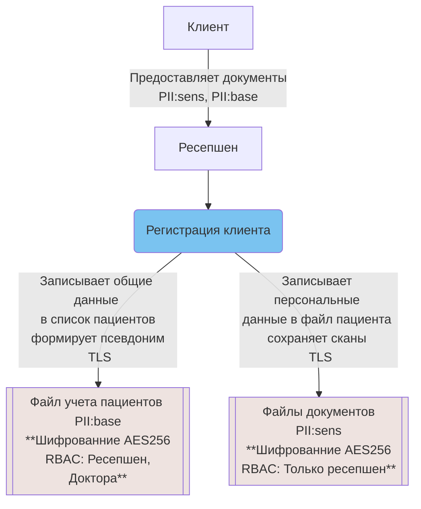
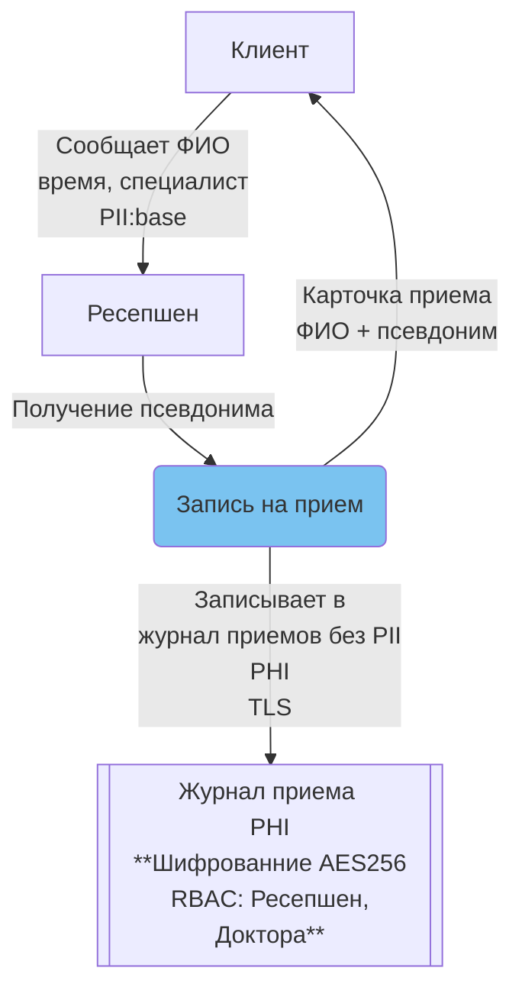
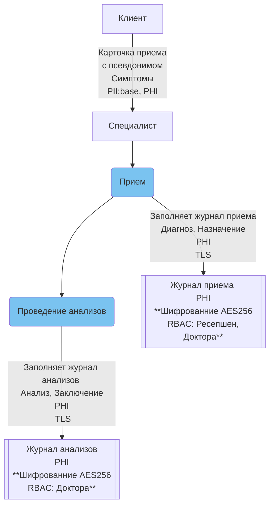
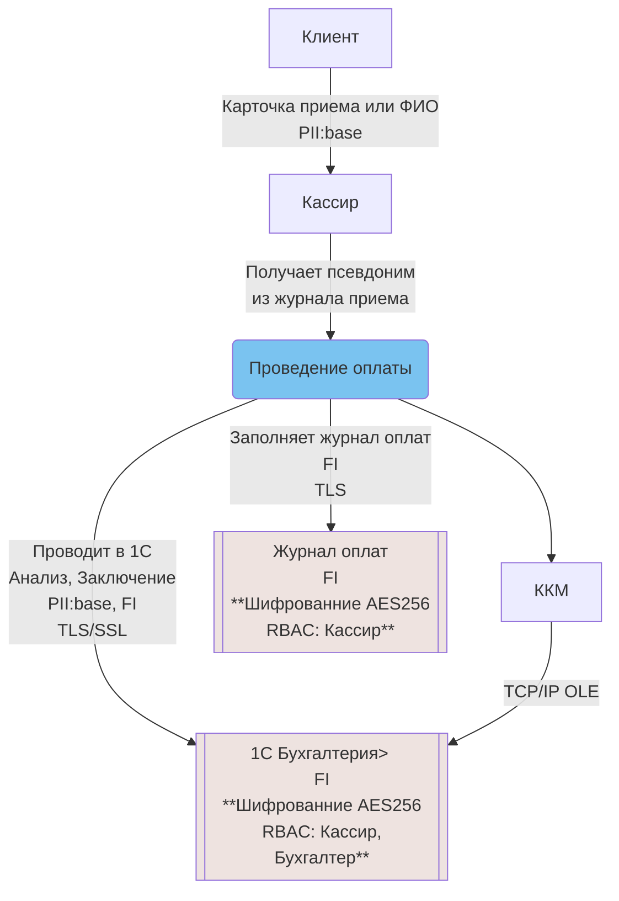
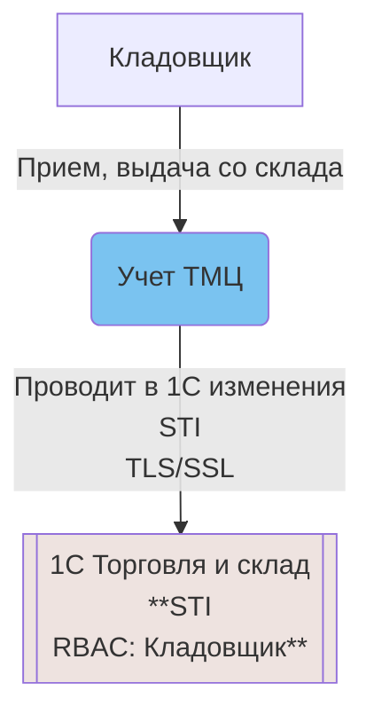

Для повышения безопасности данных текущую ситуацию можно значительно улучшить без значительных вложений, выполнив следующие шаги:
1. разделить данные по типу и чуствительности, 
2. применить шифрование на файловом сервере для данных в покое (AES256)
3. настроить разграничение доступа для разных типов данных
4. настроить шифрование при передаче (SMB пока офис один, TLS - при открытии новых филиалов)
5. использовать псевдоним клиента (номер) в медицинских журналах

## Регистрация

## Запись на прием

## Прием пациента

## Оплата услуг

## Склад

